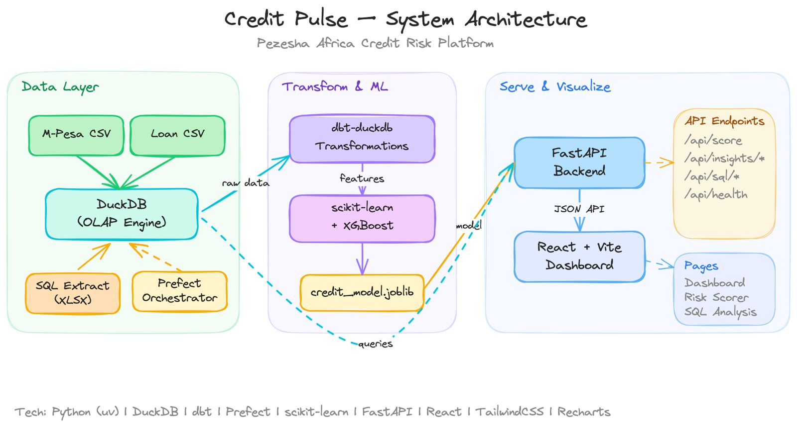
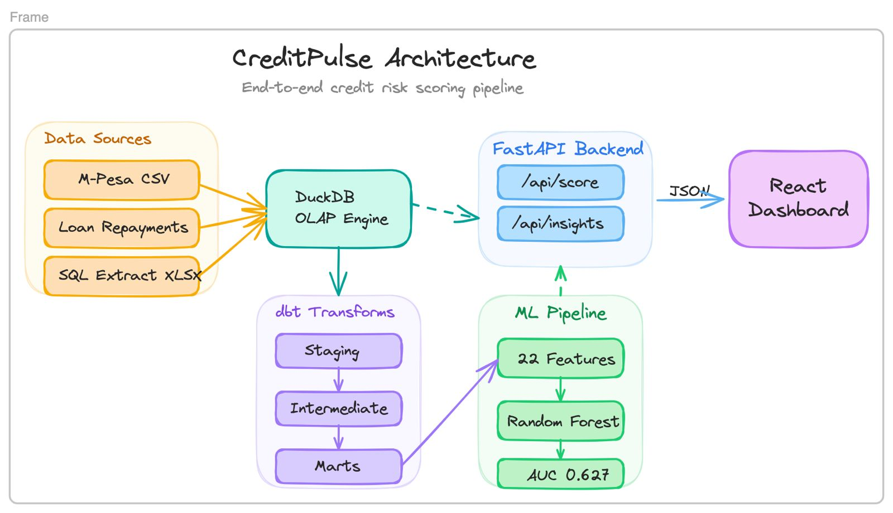
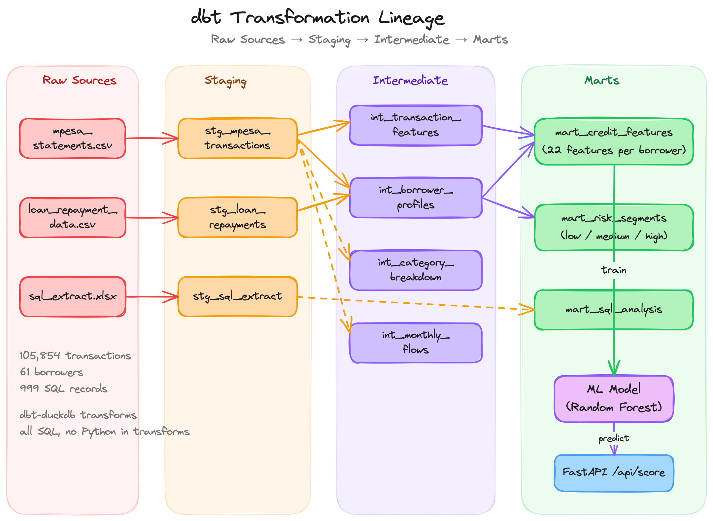

# Credit Pulse

Credit risk scoring platform analyzing M-Pesa transaction data for 61 borrowers. Built as part of the Pezesha Africa data engineering assessment.

## Architecture

### System Overview



### System Architecture



### dbt Transformation Lineage



### Project Structure

```
credit-pulse/
├── backend/         FastAPI application (API + model serving)
│   ├── api/routes/  REST endpoints: scoring, insights, SQL analysis
│   ├── core/        Config, database connection management
│   ├── models/      Pydantic request/response schemas
│   └── services/    Business logic: credit model, analytics, features
├── dbt/             dbt-duckdb transformations
│   └── models/      staging → intermediate → marts
├── frontend/        React + Vite + TailwindCSS + Recharts
├── pipelines/       Data ingestion and model training scripts
├── sql/             Standalone SQL analysis queries
├── docs/            Strategy documents (Tasks 5 & 6)
└── artifacts/       Trained model + metrics (gitignored)
```

## Tech Stack

| Layer | Tool |
|-------|------|
| Database | DuckDB (embedded OLAP) |
| Transforms | dbt-duckdb |
| ML | scikit-learn (Logistic Regression, Random Forest, Gradient Boosting) |
| API | FastAPI |
| Frontend | React + Vite + TailwindCSS + Recharts |
| Package Mgmt | uv |

## Quick Start

### Prerequisites

- Python 3.11+
- Node.js 18+
- [uv](https://docs.astral.sh/uv/)

### Setup

```bash
# Install Python dependencies
uv sync

# Install dbt (optional, for running transformations)
uv pip install dbt-duckdb

# Install frontend dependencies
cd frontend && npm install && cd ..

# Ingest data into DuckDB
make ingest

# Run dbt transformations
make dbt-run

# Train credit scoring model
make train

# Build frontend
make frontend-build

# Start the server
make serve
```

Then open http://localhost:8000 to view the dashboard.

### Development

```bash
# Run frontend dev server (port 5173) + API server (port 8000) concurrently
make dev
```

## Data

- **mpesa_statements.csv**: 105,854 M-Pesa transactions across 61 customers
- **loan_repayment_data.csv**: 61 loans (73.8% repaid, 26.2% defaulted)
- **sql_extract.xlsx**: 999 records, 100 users

Place data files in `data/` (gitignored).

## API Endpoints

| Method | Path | Description |
|--------|------|-------------|
| GET | `/health` | Health check |
| POST | `/api/score` | Score a borrower's credit risk |
| GET | `/api/insights/overview` | Portfolio summary stats |
| GET | `/api/insights/features` | Feature importance from trained model |
| GET | `/api/insights/segments` | Risk segment distribution |
| GET | `/api/insights/transactions` | Transaction pattern charts data |
| GET | `/api/insights/repayment` | Repayment distribution |
| GET | `/api/insights/betting` | Betting spend vs default correlation |
| GET | `/api/sql/total` | SQL extract: total records & users |
| GET | `/api/sql/latest-per-user` | SQL extract: latest record per user |
| GET | `/api/sql/top-users` | SQL extract: top 5 users by records |
| GET | `/api/sql/records-per-day` | SQL extract: daily record counts |

## Feature Engineering

22 features computed from M-Pesa transactions via dbt:

- **Volume**: transaction_count, active_days, transaction_frequency
- **Flows**: total_inflows, total_outflows, inflow_outflow_ratio
- **Balance**: avg_balance, min_balance, max_balance, balance_volatility
- **Received**: avg_received_amount, max_received_amount
- **Behavioral**: betting_spend_ratio, utility_payment_ratio, cash_withdrawal_ratio, airtime_spend_ratio, merchant_spend_ratio, p2p_transfer_ratio
- **Products**: loan_product_count
- **Temporal**: spending_consistency, days_since_last_transaction, account_age_days

## Model Performance

### Tuned Results (after finetuning)

Cross-validated on 61 borrowers (5-fold repeated stratified, 10 repeats):

| Model | Mean AUC | Std | Improvement |
|-------|----------|-----|-------------|
| Random Forest | **0.761** | 0.113 | +0.134 |
| Gradient Boosting | 0.722 | 0.097 | +0.226 |
| Logistic Regression | 0.712 | 0.135 | +0.136 |
| Stacking Ensemble | 0.688 | 0.159 | — |

Best model: **Random Forest** (tuned with RandomizedSearchCV, `class_weight='balanced_subsample'`, feature selection from 22 → 10 features, probability calibration).

### Finetuning Techniques Applied

- **Feature selection**: SelectKBest reduced 22 features to 10 most predictive
- **Hyperparameter tuning**: RandomizedSearchCV (50 iterations, RepeatedStratifiedKFold)
- **SMOTE comparison**: Tested oversampling vs class weighting per model
- **Stacking ensemble**: Combined all tuned models with logistic meta-learner
- **Probability calibration**: CalibratedClassifierCV for reliable probability estimates

### Baseline Results (before finetuning)

| Model | Mean AUC | Std |
|-------|----------|-----|
| Random Forest | 0.627 | 0.186 |
| Logistic Regression | 0.576 | 0.197 |
| Gradient Boosting | 0.496 | 0.133 |

## Strategy Documents

- [Real-time Processing Strategy](docs/realtime_strategy.md) — Scaling to 1M+ transactions/day with Kafka + PySpark
- [PataSCORE Alternative Data Strategy](docs/patascore_strategy.md) — Credit scoring with mobile money, utilities, device, and behavioral data
